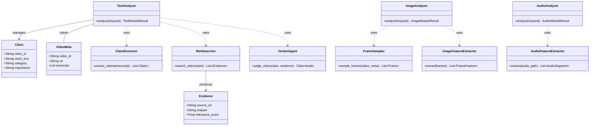

```mermaid
classDiagram
    %% 엔티티 (데이터)
    class Claim {
        +String claim_id
        +String claim_text
        +String category
        +String importance
    }
    class Evidence {
        +String source_url
        +String snippet
        +Float relevance_score
    }
    class VideoMeta {
        +String video_id
        +String url
        +List transcript
    }
    
    %% 컨트롤러 (메인 로직)
    class TextAnalyzer {
        +analyze(request) TextModuleResult
    }
    class ImageAnalyzer {
        +analyze(request) ImageModuleResult
    }
    class AudioAnalyzer {
        +analyze(request) AudioModuleResult
    }
    
    %% 보조/서비스 클래스
    class ClaimExtractor {
        +extract_claims(transcript) List~Claim~
    }
    class WebSearcher {
        +search_claim(claim) List~Evidence~
    }
    class VerdictAgent {
        +judge_claim(claim, evidence) ClaimVerdict
    }
    class FrameSampler {
        +sample_frames(video_meta) List~Frame~
    }
    class ImageFeatureExtractor {
        +extract(frames) List~FrameFeature~
    }
    class AudioFeatureExtractor {
        +extract(audio_path) List~AudioSegment~
    }

    %% 관계 정의
    TextAnalyzer ..> ClaimExtractor : uses
    TextAnalyzer ..> WebSearcher : uses
    TextAnalyzer ..> VerdictAgent : uses
    TextAnalyzer --> Claim : manages
    WebSearcher --> Evidence : produces
    
    ImageAnalyzer ..> FrameSampler : uses
    ImageAnalyzer ..> ImageFeatureExtractor : uses
    
    AudioAnalyzer ..> AudioFeatureExtractor : uses
    
    TextAnalyzer -- VideoMeta : inputs
```