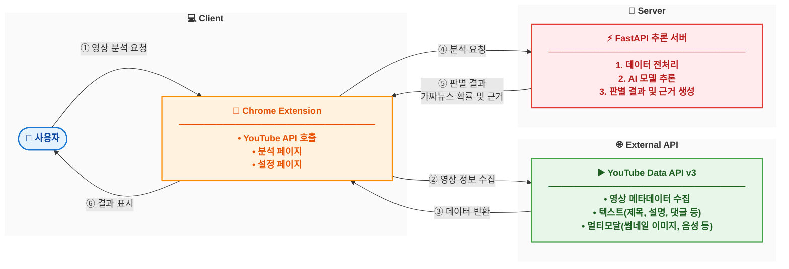

# 개발 시스템 개요

## 1. 시스템 구성도

## 2. 시스템 개요

BbongGuard는 사용자가 YouTube 영상을 시청하는 환경에서 실시간으로 가짜뉴스 여부를 판별하는 시스템이다. Chrome Extension(클라이언트)과 FastAPI 추론 서버로 구성된 클라이언트-서버 아키텍처를 채택하여, 사용자 인터페이스와 AI 추론 로직을 분리함으로써 확장성과 유지보수성을 확보하였다.

## 3. 주요 기능

### 3.1 Chrome Extension (클라이언트)

사용자는 Chrome 브라우저에서 YouTube 영상을 시청하며 BbongGuard 확장프로그램 아이콘을 클릭하여 분석을 시작한다. 확장프로그램은 Manifest V3 기반으로 구현되었으며, Content Script가 현재 재생 중인 영상의 Video ID를 추출하면 Background Service Worker가 YouTube Data API를 호출하여 영상 정보, 댓글, 관련 영상 데이터를 수집한다. 수집된 데이터는 추론 서버로 전송되며, 분석 결과는 Popup UI를 통해 가짜뉴스 확률과 신뢰도를 색상 코드(녹색, 노란색, 빨간색)로 시각화하여 제공한다. Options Page에서는 YouTube API 키와 추론 서버 URL을 설정할 수 있다.

### 3.2 YouTube Data API 연동

Google YouTube Data API v3를 활용하여 영상 메타데이터를 수집한다. 영상의 제목, 설명, 채널 정보, 조회수 등의 기본 정보와 함께 댓글 20개, 관련 영상 9개를 수집하며, 향후 멀티모달 분석을 위해 썸네일 이미지와 음성 정보도 수집할 예정이다. 일일 무료 할당량은 10,000 units이며, 영상 1개 분석 시 약 102 units가 소모된다.

### 3.3 FastAPI 추론 서버

FastAPI 프레임워크 기반의 RESTful API 서버로, 클라이언트로부터 수신한 영상 데이터를 전처리하고 AI 모델을 통해 가짜뉴스 여부를 판별한다. 현재는 기존 연구 논문을 기반으로 Doc2Vec 임베딩과 1D CNN 분류기를 활용한 베이스라인 모델이 구현되어 있으나, 이는 임시 구현으로 향후 대폭 개선될 예정이다. 개선 계획으로는 BERT, KoBERT 등 Transformer 기반 최신 언어 모델 적용, 썸네일 이미지와 음성을 포함한 멀티모달 분석 구현, 한국어 YouTube 데이터셋 구축 및 도메인 특화 파인튜닝이 포함된다.

## 4. 기술 스택

클라이언트는 Chrome Extension Manifest V3 기반으로 JavaScript(ES6+)와 HTML5/CSS3로 구현되었으며, 서버는 FastAPI 프레임워크와 Python 3.10 이상 환경에서 구동된다. 현재 AI 모델은 TensorFlow와 Gensim을 활용한 Doc2Vec + CNN 구조로 임시 구현되어 있으며, 향후 HuggingFace Transformers 라이브러리를 통해 BERT, KoBERT 등 최신 언어 모델로 전환할 예정이다. 멀티모달 분석을 위해서는 Vision Transformer(이미지)와 Whisper(음성) 모델을 추가로 도입할 계획이다.

## 5. 향후 개선 계획

### 5.1 AI 모델 고도화

현재 구현된 Doc2Vec + CNN 모델은 기존 연구 논문의 재현에 그치며, 고전적인 임베딩 기법과 영어 데이터셋에 의존한다는 한계를 가진다. 이를 극복하기 위해 BERT, RoBERTa, KoBERT 등 Transformer 기반 사전학습 언어 모델을 적용하여 문맥 이해 능력을 향상시키고, 한국어 YouTube 영상 데이터셋을 구축하여 도메인 특화 파인튜닝을 수행할 예정이다. 또한 최신 토크나이저(SentencePiece, WordPiece)를 활용하여 한국어 토큰화 품질을 개선한다.

### 5.2 멀티모달 분석 구현

텍스트 정보만으로는 가짜뉴스를 판별하는 데 한계가 있으므로, 썸네일 이미지, 음성, 영상 프레임 등 멀티모달 데이터를 활용한 종합적인 분석을 구현할 계획이다. Vision Transformer 모델을 통해 선정적이거나 자극적인 썸네일을 탐지하고, Whisper 모델로 음성을 텍스트로 변환하여 감정 분석과 말투 패턴을 분석한다. 또한 영상 프레임 분석을 통해 딥페이크나 조작된 클립을 식별하는 기능을 추가한다.

### 5.3 시스템 확장

모델 경량화(ONNX, TensorRT)를 통한 실시간 추론 최적화, 클라우드 서버 배포(AWS, GCP)를 통한 확장성 확보, 영어와 일본어 등 다국어 지원, Firefox와 Edge 등 다른 브라우저로의 확장을 단계적으로 추진한다.